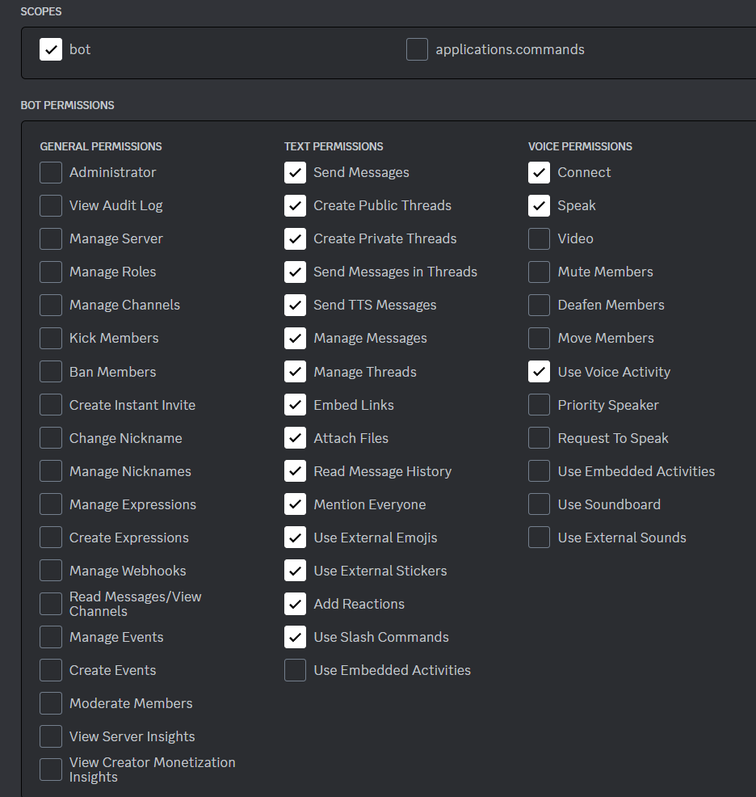

# ChatGPT Bots
Python based ChatGPT bot integrations

## `Notice`
The Discord client is a little behind as I've spent the majority of time working on the Slack version. It should still work, but it's missing a lot of the functionality included in the Slack version. The CLI version is very basic as it's only text based.

## Description
ChatBot Integrations for Slack, Discord, and the CLI using Python and OpenAPI's ChatGPT platform.

## Getting Started

Requires `Python 3.10+` as the script takes advantage of the new structural pattern matching (match/case) in this version.  

The setup of a Slack or Discord App is out of scope of this README. There's plenty of documentation online detailing these processes.
  
### Slack quickstart guide: https://api.slack.com/start/quickstart
#### The Slack event subscriptions and scope are as follows:

| Event Name  	| Description                                                       	| Required Scope    	|
|-------------	|-------------------------------------------------------------------	|-------------------	|
| app_mention 	| Subscribe to only the message events that mention your app or bot 	| app_mentions:read 	|
| message.im  	| A message was posted in a direct message channel                  	| im:history        	|    
    
#### Slack OAuth & Permissions (Scopes):
| Scope                	|
|----------------------	|
| app_mentions:read    	|
| channels:history     	|
| channels:join        	|
| chat:write           	|
| chat:write.customize 	|
| commands             	|
| files:read           	|
| files:write          	|
| im:history           	|
| im:read              	|
| im:write             	|

---

### Discord OAuth2 


---

### Install `venv` module if you don't already have it
`python3 -m pip install --user venv`

### Clone the repository
`git clone https://github.com/protella/chatgpt-bots`

### Create and Activate the Virtual Environment
```
cd chatgpt-bots
python3 -m venv chatbots
source chatbots/bin/activate
```

### Installing Dependencies:
```python3 -m pip install -U -r requirements.txt```

- _Note: The included `requirements.txt` file includes all of the dependencies for all 3 clients in this repo._

### Setup `.env` file
- Aquire the necessary keys or tokens from the integration you're using. 
I.e., OpenAI, Slack and Discord tokens.
The only required token is the OPENAI_KEY. The others depend on which integration you're using.

- Create a `.env` file in the root folder of the repo and populate it with your keys and tokens as follows:

```
SLACK_BOT_TOKEN = 'YOURTOKENHERE'
SLACK_APP_TOKEN = 'YOURTOKENHERE'
OPENAI_KEY = 'YOURTOKENHERE'
DISCORD_TOKEN = 'YOURTOKENHERE'
```

### Configuration - Bot Tuning
The `SYSTEM_PROMPT` variable at the top of each script will set the tone for how the bot will respond. Telling it that it is a chatbot and with any specific style of responses will help with more appropriate responses.

### Running the bot
Run the py file for your chosen interface, e.g.:

- `python3 discordbot.py`
- `python3 slackbot.py`
- `python3 cli_bot.py`


## ToDo:
- Use Slack/Discord Threads to isolate and track individual conversations rather than maintaining a single conversation history across all users and channels.
  - Use MongoDB as a document DB to hold the long term chat thread histories.
  - For Slack, potentially use the API's conversations.history method to sync Slack's source of truth to the MongoDB
- Add command functionality to allow for changing the initial chatbot init phrase
- Update bot commands to use Slack/Discord's `/command` functionality rather than old school `!commands`
- Track context/history size using the usage stats and pop old items from the history to avoid going over the model's max context size (4k w/ 3.5-turbo but not as much of an issue with GPT4 Turbo) Adjust for different models if necessary. Lower Priority
- Clean up code, standardize style, move repeated client code to functions and utility modules.
- Create manifest file for the app
- Setup Github workflows and unit tests 


